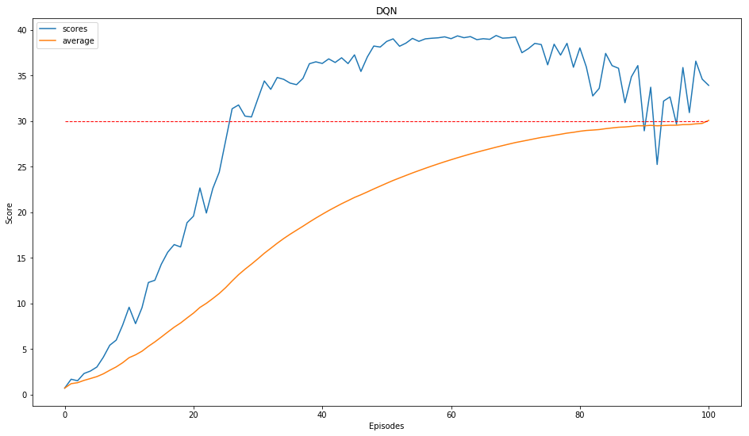

# Project 2: Continuous Control
 
## Environment
 
 
I used the environment with 20 agents controlled by a single agent. This gave the single agent a lot of information quickly to train with. I could have had separate `brains` for each agent body / arm but seemed to be overkill and would have taken a long time. Also this environment has a continuous action space which increases complexity.
 
 
## Deep Deterministic Policy Gradient (DDPG)
 
 
I choose to use the Deep Deterministic Policy Gradient algorithm (DDPG) which you can find more information in the paper [Continuous Control with Deep Reinforcement Learning](https://arxiv.org/abs/1509.02971).
 
With this we use an "actor-critic, model-free algorithm based on the deterministic policy gradient that can operate over continuous action spaces" for this environment.
 
 
## Actor-Critic Method
 
 
Both Actor and Critic networks receive the state as 33 variables.
 
The Actor outputs 4 numbers as its best predicted actions for that state, based on its optimal policy π deterministically by maximizing reward through gradient ascent.
 
The Critic outputs the prediction of the target value based on the given state which is it's optimal action-value function Q(s, a) by using the Actor's predicted action.
 
This method uses the strengths of both policy-based and value based methods.
 
 
## Epsilon Greedy Algorithm
 
 
The exploration vs. exploitation dilemma is solved with an epsilon greedy algorithm. This allows the agent to explore some of the time and choose the best path for others. As it trains it explores, chooses a random action, and slowly starts to choose the path it has determined to be the best. So we use a starting value, a decay factor and a final value. After every episode we 'decay' or reduce the starting value lower to a minimum so there is always a little exploring to do.
 
e = max(e*decay, min)
 
In this project we added noise to our actions, it seemed to be very important to reduce the noise over time at just the right amount in order to explore enough for proper training.
 
 
## Experience Replay
 
 
Experience replay allows the RL agent to learn from past experience as each state, action, reward, and next state (s, a, r, s') are saved in memory. Then samples are drawn from this buffer as part of the training. The samples are randomly selected so that the data is uncorrelated. This creates a smooth learning experience, and also provides the ability to reuse the data. Perhaps similiar to us dreaming.
 
 
## Hyperparameters
 
 
I choose to use the [Deep Deterministic Policy Gradient algorithm (DDPG)](https://arxiv.org/abs/1509.02971) with Experience Replay to solve this challenge in ~100 Episodes.  Below are some variables you can change to see how training is affected. Below are the values I used.
 
1. Agent
    - state_size = 33         # Input / State size
    - action_size = 4         # Output size
    - BUFFER_SIZE = int(1e6)  # replay buffer size
    - BATCH_SIZE = 128        # minibatch size
    - GAMMA = 0.99            # discount factor
    - TAU = 1e-3              # for soft update of target parameters
    - LR_ACTOR = 1e-3         # learning rate of the actor 
    - LR_CRITIC = 1e-3        # learning rate of the critic
    - WEIGHT_DECAY = 0        # L2 weight decay
    - EPSILON = 1.0           # explore->exploit noise process added to act step
    - EPSILON_DECAY = 0.9999  # decay rate for noise process 0.999
    - EPSILON_END = 0.005     # minimum noise 0.0001
    - Actor layers = [256, 192]
    - Critic layers = [256, 192]
 
2. Training
    - max_episodes = 250      # Maximum number of training episodes
    - max_steps = 1000        # Maximum number of timesteps per episode
 
In my first attempt, I used the first with the 1st environment with 1 agent but moved to the 20 agent environment. I also started with 2 FC layers with 512 units each but this took too much time so I switched to 256 and 192 to see if that would work. This model solved the environment but took 100+ episodes and around 10 hrs. I believe it would have solved in nearly half the time if I reduced my buffer size to 1e5.
 
I used batch normalization to keep both model's first layer outputs from getting too large.
 
I built a quick for loop to see which exploration decay seemed best. As you can see from above I choose 0.9999. The other 2 seemed to reduce exploration too quickly and took much longer to get to above a 30 score.
 
- Episode 0.9998  0.9999  0.999
- 1     0.81871 0.90483 0.36770
- 2     0.67029 0.81872 0.13520
- 3     0.54878 0.74081 0.04971
- 4     0.44929 0.67031 0.01828
- 5     0.36784 0.60652 0.00672
- 10    0.13531 0.36786 0.00005
- 20    0.01831 0.13532 0.00000
- 30    0.00248 0.04978 0.00000
- 40    0.00034 0.01831 0.00000
- 50    0.00005 0.00674 0.00000

Steps per Episode = 1000 
 
 
## Results
 
 
Training for max_episodes: 250 and max_steps: 1000
- Episode   Mean    Average Epsilon Duration
- 1         0.692   0.692   0.9048  3.44
- 2         1.665   1.178   0.8187  3.52
- 3         1.497   1.285   0.7408  3.51
- 4         2.292   1.537   0.6703  3.55
- 5         2.566   1.743   0.6065  3.56
- 6         3.007   1.953   0.5488  3.57
- 7         4.081   2.257   0.4966  3.59
- 8         5.397   2.650   0.4493  3.62
- 9         5.957   3.017   0.4066  3.67
- 10        7.608   3.476   0.3679  3.70
- 20        18.848  8.389   0.1353  4.32
- 30        30.453  14.298  0.0498  5.12
- 40        36.506  19.358  0.0183  5.95
- 50        38.129  22.866  0.0067  6.75
- 60	    39.249	25.537	0.0050	6.92
- 70	    39.145	27.481	0.0050	6.85
- 80	    35.910	28.770	0.0050	6.97
- 90	    36.096	29.491	0.0050	6.87
- 100	    34.601	29.746	0.0050	6.80
- 101	    33.920	30.079	0.0050	593.03

Solved in 101 Episodes and 593 Minutes
 

 
I learned alot from this project. Most importantly take notes of hyperparameters tweaks and save results. The total training time on gpu was 20 hours, I had the workspace timeout a couple times and bad parameters. I have also learned to not only watch
 
 
## Future
 
 
1. Introduce negative rewards perhaps based on how far it is from goal.
2. Make a function to test many hyperparameters of a smaller range of episodes / steps to get an idea of what works best.
3. Use multiple brain's per agent arm, and take the best of those to make one.
4. Prioritize memory replay based on reward
 
5. Try some other algorithms.
 - [Proximal Policy Optimization (PPO)](https://arxiv.org/pdf/1707.06347.pdf)
 - [Asynchronous Advantage Actor-Critic (A3C)](https://arxiv.org/pdf/1602.01783.pdf), and - [Distributed Distributional Deterministic Policy Gradients (D4PG)](https://openreview.net/pdf?id=SyZipzbCb)
 
 
## Config
 
 
I ended up using Udacity's built in workspace and training on GPU and it took a few hours to train. No visual was used.
